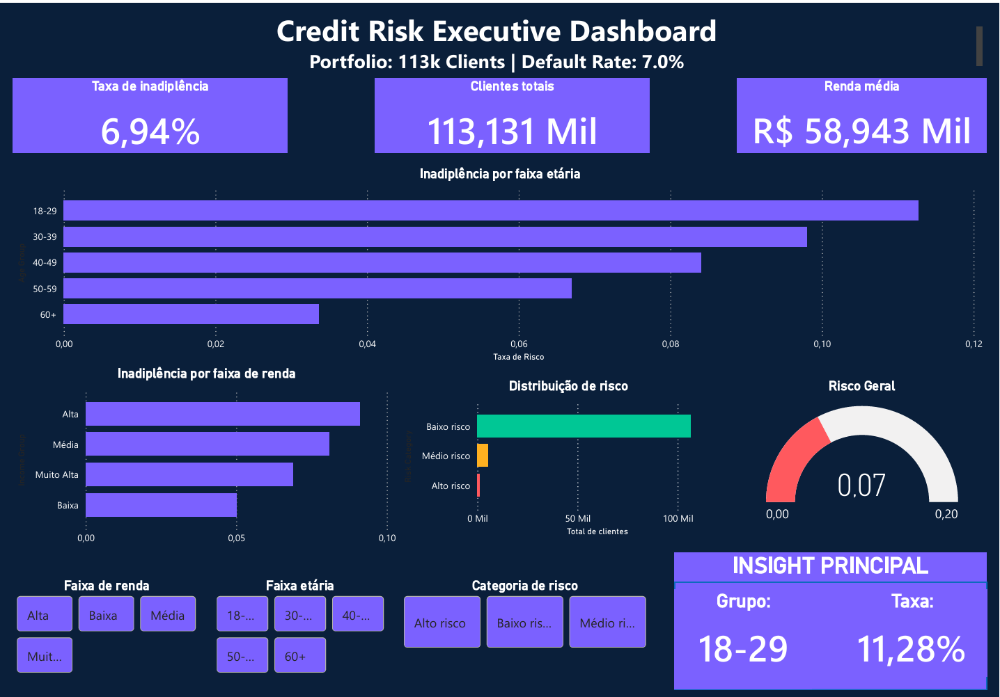

# 📊 Credit Risk Prediction | End-to-End Machine Learning Project

---

# 🚀 Visão Geral

Este projeto implementa uma solução completa de análise e previsão de risco de crédito utilizando Machine Learning, Dashboard Executivo e Aplicação Interativa.

O objetivo é simular um sistema real utilizado por bancos e fintechs para prever a probabilidade de inadimplência e apoiar decisões estratégicas de concessão de crédito.

O projeto cobre todo o ciclo de Data Science:

- Análise exploratória de dados (EDA)  
- Feature engineering  
- Treinamento de modelos preditivos  
- Avaliação de performance  
- Desenvolvimento de dashboard executivo (Power BI)  
- Deploy de aplicação interativa (Streamlit)  

---

# 🎯 Problema de Negócio

Instituições financeiras precisam avaliar o risco de inadimplência antes de conceder crédito.

Uma previsão imprecisa pode resultar em:

- perdas financeiras  
- aumento da taxa de default  
- decisões de crédito ineficientes  

Este projeto resolve esse problema prevendo a probabilidade de inadimplência com base no perfil financeiro e comportamental do cliente.

---

# 📂 Dataset

Dataset: Credit Default Dataset  
Total de registros: 150.000 clientes  

Variável target:

**SeriousDlqin2yrs**

Onde:

- 0 → Cliente adimplente  
- 1 → Cliente inadimplente  

Taxa de inadimplência da base: ~6.6%

---

# 🔎 Análise Exploratória de Dados (EDA)

Principais insights identificados:

- Clientes mais jovens apresentam maior risco de inadimplência  
- Alto índice de endividamento é um forte indicador de default  
- Maior utilização do crédito rotativo aumenta significativamente o risco  
- O dataset apresenta desbalanceamento típico de cenários reais  

Análises realizadas:

- Distribuição de variáveis  
- Correlação entre features  
- Análise por faixa etária  
- Análise por faixa de renda  
- Identificação de padrões de risco  

---

# 🤖 Modelagem de Machine Learning

Modelos testados:

## Logistic Regression

ROC AUC Score: **0.800**

---

## Random Forest Classifier (Modelo Final)

Parâmetros:

 n_estimators = 200

 max_depth = 10

 
Resultado:

**ROC AUC Score: 0.858**

O Random Forest foi selecionado como modelo final devido ao melhor desempenho e capacidade de capturar relações não lineares.

---

# 📈 Feature Importance

Principais variáveis que impactam o risco:

- RevolvingUtilizationOfUnsecuredLines  
- DebtRatio  
- MonthlyIncome  
- age  
- NumberOfOpenCreditLinesAndLoans  

Esses fatores são amplamente utilizados em modelos reais de credit scoring.

---

# 📊 Dashboard Executivo (Power BI)

Foi desenvolvido um dashboard executivo para análise estratégica do risco de crédito.

Funcionalidades:

- Taxa de inadimplência geral  
- Análise por faixa etária  
- Análise por faixa de renda  
- Distribuição por categoria de risco  
- Indicador visual de risco geral  
- Filtros interativos  

Objetivo:

Simular uma ferramenta utilizada por:

- Analistas de risco  
- Gestores de crédito  
- Cientistas de dados  

Para monitoramento e tomada de decisão.

## Visão Geral

---

# 💻 Aplicação Interativa (Streamlit)

Foi desenvolvido um aplicativo web que permite prever o risco de inadimplência em tempo real.

Funcionalidades:

O usuário pode inserir:

- Idade  
- Renda mensal  
- Índice de endividamento  
- Linhas de crédito  
- Histórico de atrasos  
- Utilização de crédito  
- Número de dependentes  

O sistema retorna:

- Probabilidade de inadimplência  
- Classificação de risco  
- Score de crédito

## Demonstração

---

# 🧠 Arquitetura da Solução

Pipeline completo:

**Dados → Limpeza → EDA → Feature Engineering → Model Training → Model Evaluation → Dashboard → App Interativo**

Simulando um ambiente real de produção.

---

# 📊 Métrica de Avaliação

Métrica utilizada:

**ROC AUC Score**

Interpretação:

- 0.5 → aleatório  
- 0.7 → bom  
- 0.8 → excelente  
- 0.9 → nível produção  

Resultado obtido:

**0.858 → excelente desempenho**

---

# 🛠️ Tecnologias Utilizadas

- Python  
- Pandas  
- NumPy  
- Scikit-learn  
- Matplotlib  
- Seaborn  
- Power BI  
- Streamlit  
- Plotly  
- Pickle  

---

# 📁 Estrutura do Projeto

    CREDIT-RISK-ANALYSIS/
    │
    ├── .vscode/ # Configurações do VSCode
    │
    ├── credit-risk-app-streamlit/ # Aplicação Streamlit
    │ ├── app.py # Interface principal do Streamlit
    │ ├── model.pkl # Modelo treinado
    │ ├── requirements.txt # Dependências do app
    │ │
    │ └── data/
    │ └── credit_clean.csv # Dataset limpo usado pelo app
    │
    ├── data/ # Dados do projeto
    │ ├── credit_clean.csv
    │ └── cs-training.csv
    │
    ├── notebooks/ # Notebooks de análise
    │ ├── 01_eda_credit_risk.ipynb
    │ └── df_clean.csv
    │
    ├── venv/ # Ambiente virtual
    │
    ├── requirements.txt # Dependências gerais
    │
    └── README.md # Documentação do projeto

---

# ▶️ Como executar o App

Instale as dependências:

bash

pip install -r requirements.txt

Execute o app:

streamlit run app.py

---

# 💼 Aplicação no Mundo Real

Esta solução pode ser utilizada por:

- Bancos

- Fintechs

- Plataformas de crédito

- Empresas de análise de risco

Para:

- Avaliar risco de clientes

- Apoiar concessão de crédito

- Reduzir inadimplência

- Melhorar decisões financeiras

---

# 🎯 Principais Competências Demonstradas

Este projeto demonstra habilidades em:

- Machine Learning

- Análise de dados

- Feature engineering

- Model evaluation

- Data visualization

- Business intelligence

- Desenvolvimento de aplicações

- Resolução de problemas de negócio

---

# 👨‍💻 Autor

Alan
Data Analyst | Future Data Scientist

Projeto desenvolvido como parte do meu portfólio com foco em Ciência de Dados e aplicações no setor financeiro.

